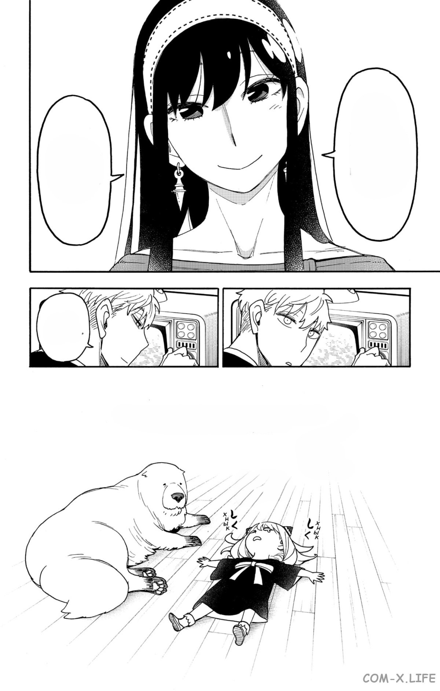

# Colouranga - consistent colorization of manga characters

This work presents a pipeline for consistent colorization of manga characters, which allows you to automate the process of character colorization while preserving their base colors, which greatly simplifies the entire colorization process.

You must specify the folders where the original black and white manga pages, color examples of character coloring, and the folder for saving the final colored versions are located.

 <b>Fig.1 Manga page</b>

| | |
|:--:|:-:|
| |  |
| |  |

 <b>Fig.2 Colorized characters</b>

---

## Usage

- Clone this repository
- Create Python 3.10 virtual environment:
    - `python3.10 -m venv .venv`
- Activate it and run:
    - `pip install -r requirements.txt`
- ???
- See [this notebooks](notebooks/example.ipynb)